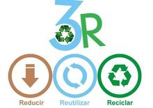

Actuamente no se puede llegar a garantizar una protección segura al 100% del medio ambiente, pero si se puede emplear algunos métodos para poder cuidarlo más.
Un ejemplo de este caso es la regla de las 3 R, reduce, recicla y reutiliza. Además de esto es importante que consumamos con responsabilidad, comprando productos que no dañan el medio ambiente, utilizar energias renovables...

